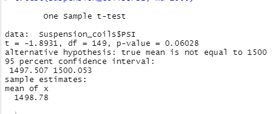

# MechaCar_Statistical_Analysis

## Overview
The purpose of this assignment was to utilize RStudio and conduct statistics on the data. Utilizing the data for MechaCar and Suspension coils, we will be running multiple liner regression analysis, collecting summary statistics, running t-tests to determine if the data is statistically significant and designing a statistical study to compare vehicle performance against manufactures.

## Linear Regression to Predict MPG
* 
* The two variables that provided a non-random amount of variance to the MPG values were the vehicle length and the spoiler angle. The P-value for vehicle length was and ground_clearance was > 0.05.
* While values are close to zero, the linear model is not considered to be zero as the coefficients for most of the variables are significant.

* As noted in the above image, The R-squared result from the data is 0.7149 indicating that 71.49% of the time, it will predict mpg prototypes effectively majority of the time, but there is still other variables that may not be included in the dataset, which contribute to the difference in the mpg.

## Summary Statistics on Suspension Coils

By looking at the total summary the variance is 62.29 indicating that on average across all three manufacturing lots, it does meet the design specifications.

Upon review of each of the individual manufacturing lots, both lot 1 and lot 2 are under the variance of 100, with 0.97 and 7.46 variance level respectively. However, Lot3 has a variance of 170.28 which is above the design specifications for the MechaCar suspension coils. 

## T-Tests on Suspension Coils

As noted in the above summary for all manufacturing lots, the t test result shows a p-value of 0.06028. this value is above our 0.05 significance level, and therefore we cannot reject the null hypothesis and there is NO statistical difference observed.

As noted in the three images above, the P value for each lot is as Follows:
For both Lot 1 and Lot 2, the P-value is above our 0.05 significance level and therefore we cannot reject the null hypothesis, thus stating there is NO statistical difference observed. However, for lot 3 the P-value is 0.04168 which is lower than our significance level , indicating there IS a statistical difference between the observed sample mean and its presumed population mean

##Study Design: MechaCar Vs Competition
* Metrics that would be of interest to a consumer would be maintenance cost and safety rating compared against its competition. Maintenance cost of a vehicle cannot be avoided, therefore should be considered and safety rating is critical in having a vehicle that is safe on the road, but also safe for its passengers.
* Metrics to be tested would include the safety rating from multiple competitors. Cars with a higher price should also have a higher safety rating. 
* The null hypothesis: the cost of all vehicles regardless of the safety rating is the same. The alternative hypothesis would be that the cost of the vehicle regardless or safety rating, is not zero.
* The statistical test I would use to test the hypothesis would be a one sample t-test. Using this type of statistical test, we would identify if there is a statistical difference between the mean of the sample distribution, which is MechaCar, versus the mean of the population, which in this case would be other competitors in the manufacturing industry
* Data needed to run the statistical test would include a randomized sample of the MechaCar vehicles, a random sample of at least two additional competitor vehicles in addition to the safety ratings for all vehicles.  I would want to calculate this data over a 1 year time frame so we would need the information for the past year for a minimum of 50 vehicles from each competitor totaling to 150 vehicles in the sample.

